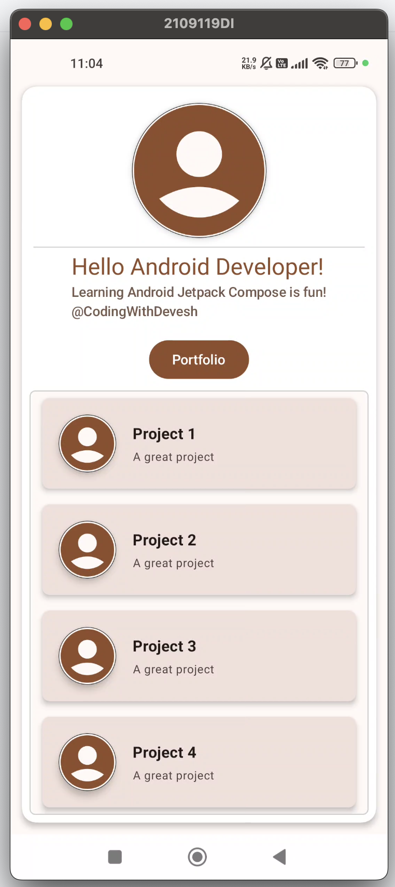

# 🚀 Jetpack Compose Tutorial for Beginners

Jetpack Compose is Android’s **modern UI toolkit** that makes it easier and faster to build beautiful and responsive apps using **Kotlin**.

This guide is perfect for those who are **new to Jetpack Compose** and want to **get started quickly** with examples, explanations, and a comparison to the traditional XML-based UI.

---

## 🧠 Why Learn Jetpack Compose?

Jetpack Compose is **the future of Android UI development**, and Google is actively pushing it as the default choice for building new UIs. Here's why you should learn it:

- ✅ **Declarative**: Describe *what* the UI should look like, and Compose takes care of the rest.
- ⚡ **Faster Development**: Write less code and preview UI instantly with Android Studio.
- 🔄 **Reactive**: Automatically updates the UI when your data changes.
- 💪 **Kotlin-first**: Compose is built entirely in Kotlin, letting you use all modern Kotlin features.
- 🧩 **Easily Customizable**: Create reusable components with ease.
- 🔗 **Integrates with existing Views**: You can mix Compose and XML in the same app.

---

## 🆚 Jetpack Compose vs XML

| Feature                        | Jetpack Compose                     | XML + View System               |
|-------------------------------|-------------------------------------|---------------------------------|
| UI Definition Language         | Kotlin code                         | XML layout files                |
| Code Reuse & Modularity        | High (functions & Composables)      | Medium                          |
| Performance                    | Optimized for modern devices        | Slightly more overhead          |
| State Management               | Built-in with `remember`, `mutableStateOf` | Requires LiveData or other frameworks |
| Boilerplate Code               | Less                                | More                            |
| Learning Curve                 | Easy if you know Kotlin             | Requires XML + Java/Kotlin mix  |
| Design-Time Previews           | Available and fast                  | Slower, needs full build        |

---

## 🛠️ Getting Started 

### 🔧 Project Setup

Ensure you are using **Android Studio Hedgehog** or later.

#### `build.gradle (project)`:
```kotlin
buildscript {
    ext {
        compose_version = '1.6.0'
    }
}
```

#### `build.gradle (app)`:
```kotlin
plugins {
    id 'com.android.application'
    id 'org.jetbrains.kotlin.android'
}

android {
    compileSdk = 34

    defaultConfig {
        applicationId "com.example.composeapp"
        minSdk = 21
        targetSdk = 34
        versionCode = 1
        versionName = "1.0"
    }

    buildFeatures {
        compose true
    }

    composeOptions {
        kotlinCompilerExtensionVersion = compose_version
    }
}

dependencies {
    implementation "androidx.compose.ui:ui:$compose_version"
    implementation "androidx.compose.material:material:$compose_version"
    implementation "androidx.compose.ui:ui-tooling-preview:$compose_version"
    implementation "androidx.activity:activity-compose:1.9.0"
}
```

---

## 💡 Basic Example

Here's a simple Hello World in Jetpack Compose:

```kotlin
@Composable
fun Greeting(name: String) {
    Text(text = "Hello, $name!")
}

@Preview(showBackground = true)
@Composable
fun GreetingPreview() {
    Greeting("Android Developer")
}
```
## 🧱 Key Concepts

### ✅ Composable Functions

Every UI element is a function annotated with `@Composable`.

```kotlin
@Composable
fun MyText() {
    Text("This is Jetpack Compose!")
}
```

### 🎨 State Management

Jetpack Compose is reactive — when data changes, the UI updates automatically.

```kotlin
@Composable
fun Counter() {
    var count by remember { mutableStateOf(0) }

    Column {
        Text("Count: $count")
        Button(onClick = { count++ }) {
            Text("Increase")
        }
    }
}
```

### 🧭 Navigation

Add navigation with the `navigation-compose` dependency:

```kotlin
implementation "androidx.navigation:navigation-compose:2.7.5"
```

Example:

```kotlin
@Composable
fun AppNavigator() {
    val navController = rememberNavController()

    NavHost(navController, startDestination = "home") {
        composable("home") { HomeScreen(navController) }
        composable("detail") { DetailScreen() }
    }
}
```

---

## 📚 Resources to Learn More

- [Official Compose Documentation](https://developer.android.com/jetpack/compose/documentation)
- [Compose Pathway on Developer Android](https://developer.android.com/learn/pathways/compose)
- [Jetpack Compose Samples](https://github.com/android/compose-samples)

---

## 🙌 Contributing

Feel free to fork and improve this tutorial. Pull requests are welcome!---

---

## 📷 Screenshots



---

## 🚀 What is Jetpack?

Jetpack is a suite of libraries, tools, and architectural guidance from Google designed to help developers write high-quality Android apps more easily. It combines the existing Android support libraries and components with new libraries to simplify common development tasks. Jetpack components are modular and built to work together while taking advantage of Kotlin language features for greater efficiency. Some key components include:

- **Compose**: Modern UI toolkit for building native Android UI
- **Room**: Database abstraction layer over SQLite
- **Navigation**: Framework for navigating between destinations
- **ViewModel**: Lifecycle-aware data holder for UI
- **WorkManager**: Background processing management
- **CameraX**: Camera app development API
- **DataStore**: Data storage solution
All of there helps to build morden apps and follows best practices.

---